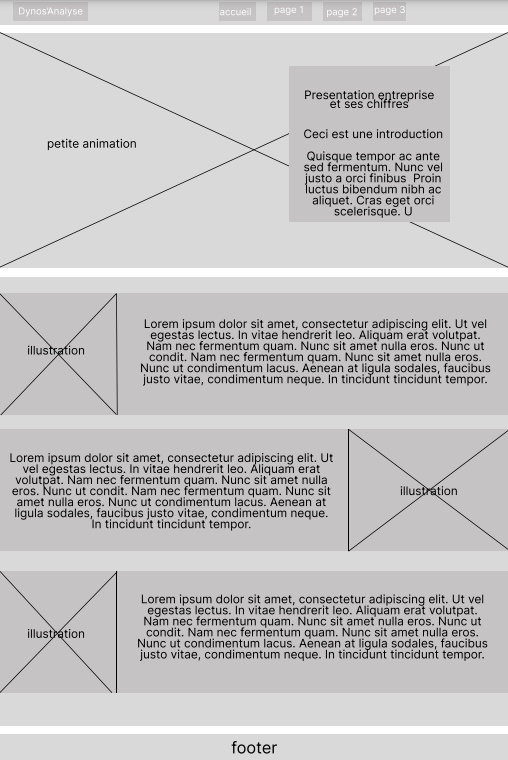

# SAÉ S1. 05-06

*******
## Table des matières 
* [Présentation Général](#presentation)
* [Zooning & Prototype de la page](#zooning)
* [Certification W3C](#W3C)
* [Avancement du projet](#avancement)
* [Lancer le projet](#lancer) 
* [Répartition des tâches](#tache)
* [Crédit](#credit)
*******

 

## Presentation Général

Le site que nous développons à pour objectif de présenter l'entreprise BPCE-IT (Banque Populaire Caisse Epargne Infogérence et Technologie) dans le cadre d'un SAE (Situation d'Apprentissage et d'Evaluation) durant notre première année de BUT Informatique à l'IUT de Belfort.

## Zoning et prototypage du site
### I/ Zonning 
-  Page d'accueil :

- Page 1 : 

- Page 2 : 

### II/ Prototype 

- Page d'accueil 

## Certification W3C 
Veuilliez cliquez<a href = "CertificationW3C_A2-groupe6-1.pdf" target=_blank> ici </a> pour voir la certfication W3C de chacun de nos pages

## Avancement du projet
- 07/10/2022 : La page d'accueil est finalisé, totalement responsive
- 12/10/2022 : La page "Qui sont-ils ?" est finalisé, totalement responsive
- 14/10/2022 : La page "Quels enjeux ?"  est finalisé, totalement responsive 
- 15/10/2022 : La page "Projet Majeurs ?" finalisé, totalement responsive 

 

## Lancer le projet
Rendez vous sur ce lien : https://tgoussot.github.io/G6_SAE1.05-06_BPCE-IT/index.html

  
## Répartition des tâches
Rémi FREYMONT auteur de la page "Qui sont-ils ?", auteur de la partie "Le fonctionnement de l'entreprise" dans le rapport économique. 
  
Alexandre GARNIER auteur de la page "Quels enjeux ?", auteur de la partie "L'organisation de l'entreprise" dans le rapport économique, réalisation des 2 questionnaires clients qui ont permis de connaître les besoins de notre client. 
  
Yonnis PEYROUS co-auteur de la page d'accueil et de la page "Projets Majeurs", auteur de la page "Histoire de l'entreprise et impact environnemental" du rapport économique et réalisateur des animations sur le site.
  
Théo GOUSSOT co-auteur de la page d'accueil et de la page "Projets Majeurs", auteur de la page "Information comptable et financière" dans le rapport économique et mise en relation avec Thierry HUSY responsable de service chez BPCE-IT. 

## Crédit 

Ce projet sera mené à bien grâce à : 
* Rémi FREYMONT
* Alexandre GARNIER
* Yonnis PEYROUS
* Théo GOUSSOT
